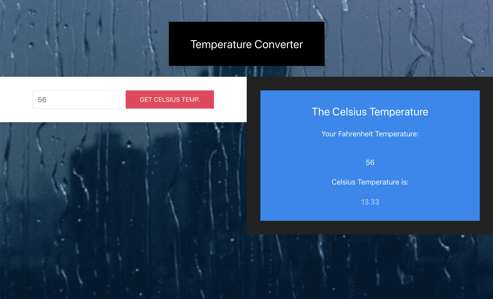

# Temperature-Conversion

This site helps users convert Fahrenheit temperature into Celsius degrees. Website is designed by using UIKit and Javascript for the functionality. 



This is the main page where users can input the temperature in fahrenheit and then then click to the degrees in celsius temperature. 

# Technology Used
- HTML
- CSS
- Javascript
- UIkit

# Code Snippets
1) This functions checks if the input is a number with isNAN. If the input is not a number then an alert appears telling the user to enter a number. 
Then if the input is a number then the it is converted to celsius and lastly fixed to two decimal places to send to the html for display. 
```
function check()
{
    var farTemp = document.getElementById("input1").value;
    document.getElementById('head1').innerHTML = farTemp;
    if(isNaN(farTemp))
    {
        alert("Not a number, please enter a number");
    }
    else
    {
        console.log("Input is a number");
    }
    var temp = parseInt(farTemp);
    var celTemp = (temp - 32) * 5 / 9;
    var Temperature = celTemp.toFixed(2);
    document.getElementById('returnValue').innerHTML = Temperature;
}
```
# Author 

[Muhammad Awais](https://mawais54013.github.io/New-Portfolio/)

[Github](https://github.com/mawais54013)
